# GoogleCloud-Hadoop-PySpark-Prediction
example of working with Google Cloud Dataproc 

* [starting cluster using web interface](#sec1) 
* [creating Job to Hive with test query "Select 1+1"](#sec2)
* [creating key pair to connect with master node using ssh](#sec3)
* [connecting to virtual machine](#sec4)
* [connecting to Hive console and making simple query](#sec5)
* [testing PIG application](#sec6)
* [starting cluster using Google Cloud Shell terminal (with Oozie as example)](#sec7)
* [starting cluster using web interface with Jupyter Notebook](#sec8)
* [creating ssh key pair](#sec9)
* [connecting to master node](#sec10)
* [working with dataset](#sec11)
* [creating python script to prepare data and writing output dataset in parquet format](#sec12)
* [creating Job to run python script](#sec13)
* [data preparation and making prediction house cost using PySpark and Linear Regression](#sec14)
* [distributed Deep Learning with PySpark and Keras](#sec15)

<a name="sec1"/>

#### starting cluster using web interface

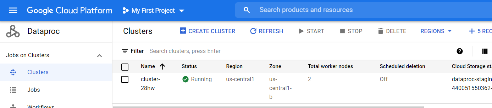

<a name="sec2"/>

#### creating Job to Hive with test query "Select 1+1"

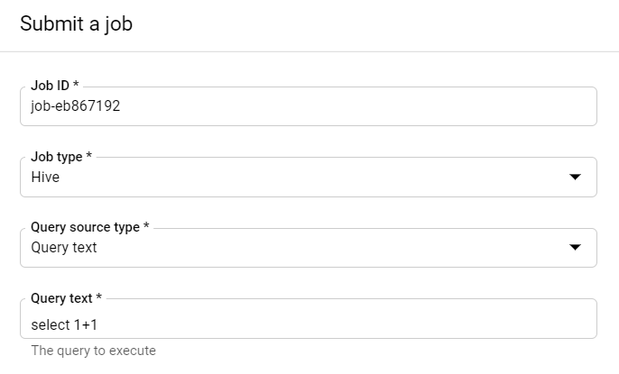

job results

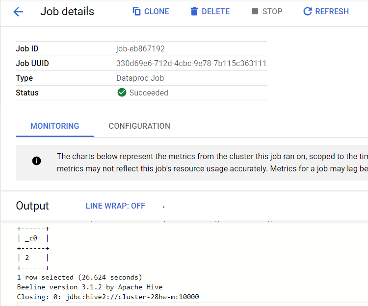

<a name="sec3"/>

#### creating key pair to connect with master node using ssh

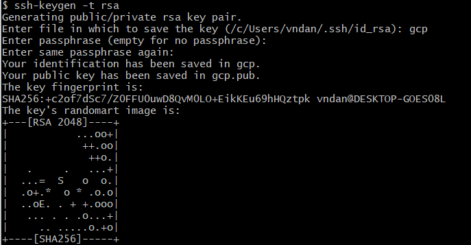

adding public key to master node

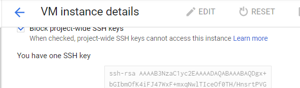

<a name="sec4"/>

#### connecting to virtual machine

<xml/>

    - username: vndan
    - ip: 34.67.91.162
    - key: gcp
    ssh -i gcp vndan@34.67.91.162
    
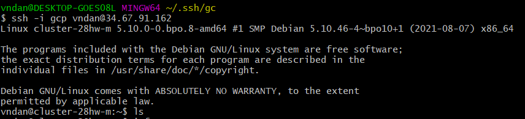

view processes

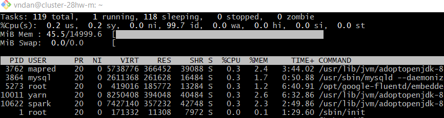

<a name="sec5"/>

#### connecting to Hive console and making simple query

<xml/>

    beeline
    !connect jdbc:hive2://
    Username: scott
    Password: tagen
    
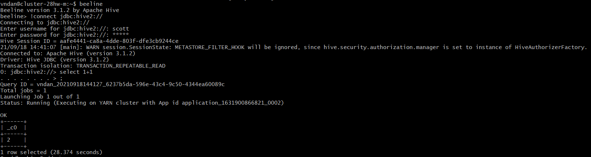

<a name="sec6"/>

#### testing PIG application  

lets create file test_pig.txt and write some text in it

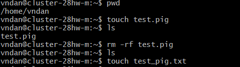
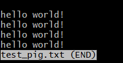
  
uploading file into Hadoop

<xml/>

    hadoop fs –ls / - what is in our directory
    hadoop fs –put test_pig.txt /home/pig – uploading file into Hadoop
    
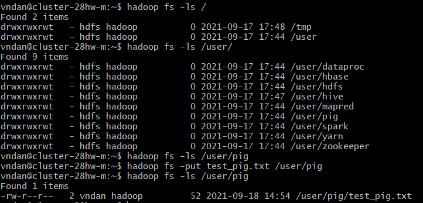

starting PIG application

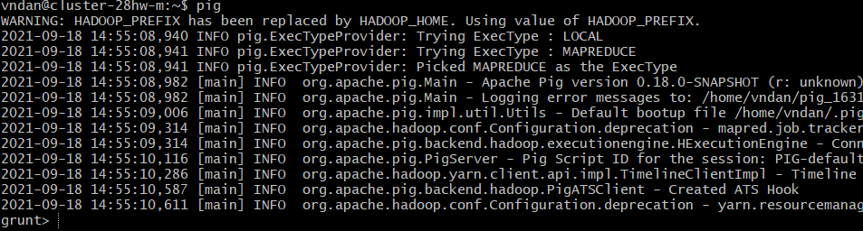

lets count word quantity in our text

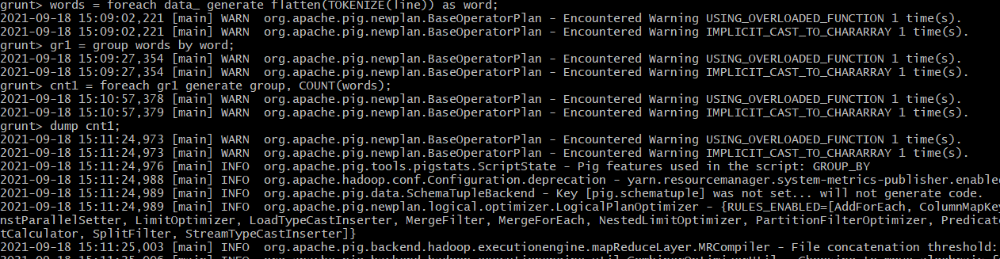

results

 
<a name="sec7"/>

#### starting cluster using Google Cloud Shell terminal (with Oozie as example)

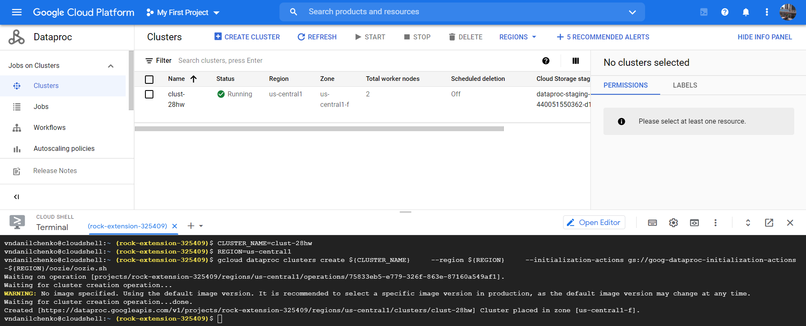

<a name="sec8"/>

#### starting cluster using web interface with Jupyter Notebook

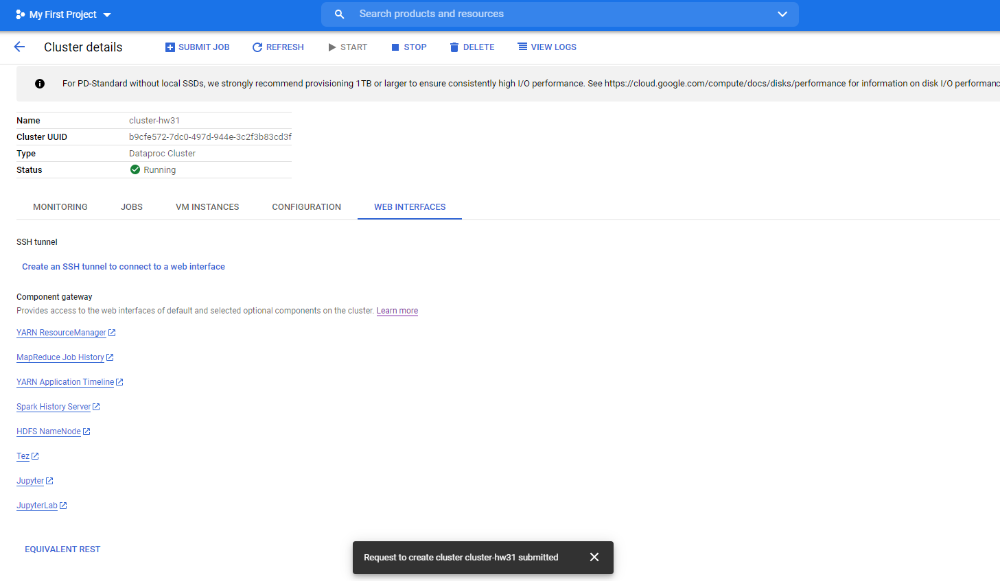

<a name="sec9"/>

#### creating ssh key pair

creating key pair to connect with master node using ssh

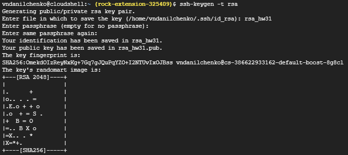

adding public key to master node

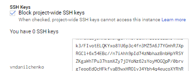

<a name="sec10"/>

#### connecting to master node

<xml/>

    ZONE=us-central1-b
    HOSTNAME=clust-hw31-m
    gcloud compute ssh ${HOSTNAME} --zone ${ZONE}
    

<a name="sec11"/>

#### working with dataset

downloading dataset and uploading it into Hadoop

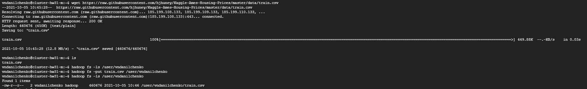

<a name="sec12"/>

#### creating python script to prepare data and writing output dataset in parquet format

[python script - "test_job.py"](/test_job.py)

<a name="sec13"/>

#### creating Job to run python script
 
copy link to python script file

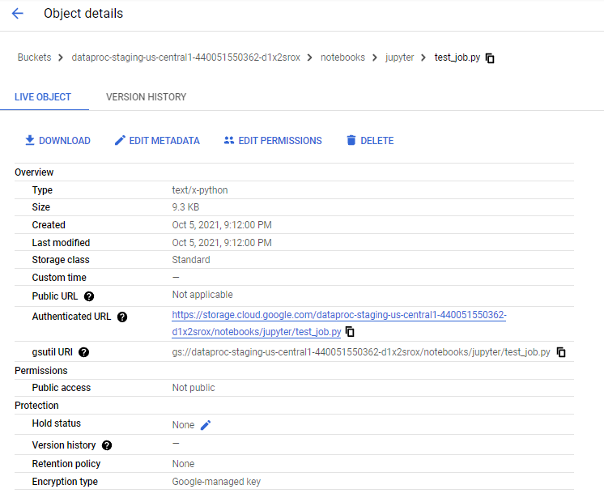

creating Job

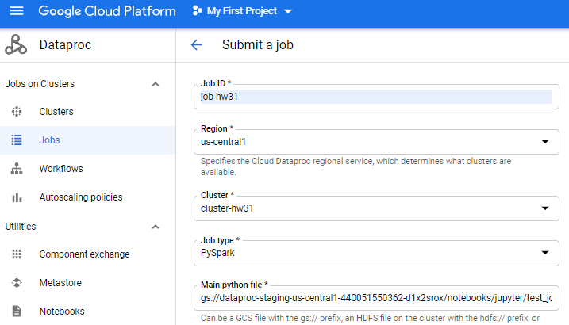

checking Job status

checking output file "train_modified_from_job.parquet"

<a name="sec14"/>

#### data preparation and making prediction house cost using PySpark and Linear Regression 

[example of making predictions using PySpark - "PySpark prediction.ipynb"](/PySpark%20prediction.ipynb)

<a name="sec15"/>

#### distributed Deep Learning with PySpark and Keras 

[example of Distributed Deep Learning in PySpark - "Distributed DL Pipelines - PySpark and Keras.ipynb"](/Distributed%20DL%20Pipelines%20-%20PySpark%20and%20Keras.ipynb)

author: Vadim Danilchenko

email: vndanilchenko@gmail.com 